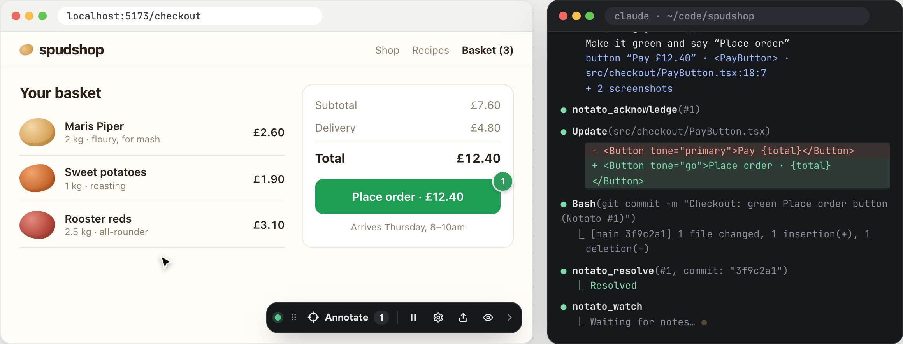

<p align="center"></p>

# Notato

**Pin a note on your running app. Your coding agent picks it up and fixes it.**

Notato puts a small toolbar in the web or mobile app you are building. Click an element (or tap one on a phone), say what is wrong, and the note reaches your coding agent over MCP with a screenshot, the component, and the file and line it was written at. The agent makes the change, commits it, and the pin on the page turns green. It works with Claude Code, Codex, Cursor, Gemini CLI, GitHub Copilot and any other MCP client, and a board shows every note and its thread to the people working on it.

<p align="center"></p>

Every piece of feedback is an **annotation**: an element, a note and screenshots. Nothing is recorded between annotations, so it is a feedback loop for building, not analytics or session replay.

| Mode      | Who annotates               | Where it goes                                              |
| --------- | --------------------------- | ---------------------------------------------------------- |
| **dev**   | The developer               | Live to a local server, read by your coding agent over MCP |
| **test**  | A tester                    | A zip bundle, or posted to a shared server                 |
| **agent** | An AI agent driving the app | Same as test, plus the steps the agent took                |

> **Not released yet.** The packages are not on npm, Maven Central, NuGet or pub.dev yet, so the install commands below work from the first release on. Until then, run Notato from source: [CONTRIBUTING.md](CONTRIBUTING.md) says how.

## Run it

```bash
npx notato
```

That is the whole server: the board at `http://localhost:4747`, and MCP for your coding agent at `http://localhost:4747/mcp`, until you stop it. Point any agent at the MCP address. On your own machine it needs no token:

```bash
claude mcp add --transport http --scope user notato http://localhost:4747/mcp
```

The board's **Settings › Agents** has the same line for Codex, Cursor, Gemini CLI and VS Code, and shows which agents are connected. Then put the toolbar in your app (below), or on any page with the [bookmark](#any-page-with-nothing-to-install). `npx notato --tunnel` adds a [dev tunnel](#phones-a-dev-tunnel) for phones; `npx notato --help` lists the rest. Run it again while one is running and it tells you where that one is.

## Add it to your app

| Your app                                       | Package                                               | How to set it up                                                        |
| ---------------------------------------------- | ----------------------------------------------------- | ----------------------------------------------------------------------- |
| React 18 and later (Vite, Next.js)             | `@notato/react` (npm)                                 | `npx notato init` does it: see the [quick start](#quick-start-dev-mode) |
| Angular 19 and later                           | `@notato/angular` (npm)                               | [Notato for Angular](sdks/angular/README.md)                            |
| Any other web app                              | `@notato/browser` (npm)                               | [The toolbar on its own](sdks/browser/README.md)                        |
| A page you did not build                       | A bookmark, or the Chrome extension                   | [Any page](#any-page-with-nothing-to-install)                           |
| SwiftUI and UIKit, iOS 17 and later            | `Notato` (Swift package)                              | [Notato for SwiftUI](sdks/swift/README.md)                              |
| Jetpack Compose and Views, Android 7 and later | `dev.notato:notato-android`, `notato-compose` (Maven) | [Notato for Android](sdks/android/README.md)                            |
| .NET MAUI, .NET 10 and later                   | `Notato.Maui` (NuGet)                                 | [Notato for .NET MAUI](sdks/dotnet/README.md)                           |
| React Native 0.76 and later, Expo or bare      | `@notato/react-native` (npm)                          | [Notato for React Native](sdks/react-native/README.md)                  |
| Flutter 3.32 and later                         | `notato` (pub.dev)                                    | [Notato for Flutter](sdks/flutter/README.md)                            |

Every SDK talks to the same server with the same wire format ([`packages/schema`](packages/schema/src/index.ts)), so the board, the agent's tools and webhooks work the same whatever the note came from.

## Quick start (dev mode)

For a React app. Each of the other SDKs has a quick start in its own README.

```bash
npm i -D notato @notato/react
npx notato init        # adds <Notato /> behind a dev-only guard, sets up your coding agents (MCP server and skills)
npm run dev             # start your app
npx notato doctor      # checks the whole loop, including that a browser page is connected
```

`init` also writes two skills (skip them with `--no-skill`). **`notato`** (`/notato` in Claude Code, `$notato` in Codex, or just ask) teaches the agent the whole loop: make the smallest change, **commit each fix on its own** (staging only its own files, so your uncommitted work is never swept in), resolve with the files and commit, answer a question instead of editing, and undo a change when you ask. One commit per annotation is what makes a revert clean. **`notato-critique`** has the agent review the running app itself and file what it finds (see [Critique mode](#critique-mode)). A skill file you have edited is left alone.

`init` edits Vite and Next.js apps for you (and prints the snippet to paste for anything else). It writes in your project's own style, taking semicolons, quotes, indentation and line width from your prettier config (or the file), so `format:check` stays green.

**A repo with several React apps.** Run it from the repo root and it works out which app to use. In a Module Federation setup the host (the shell that loads the modules) gets the toolbar, and every module loaded into it inherits it, so there is nothing to add per module. It recognises the host by how the apps link to each other, including setups where every module also declares the shell as a remote. If it cannot tell, it asks (or, with no terminal, lists the choices and stops):

```bash
npx notato init --app app-shell          # choose explicitly
npx notato init --app app-shell --agent-dir .   # register your agents for the repo root
```

**Apps that are built, not served, in development.** `import.meta.env.DEV` is false under `vite build --watch` + `vite preview`, so a dev-only guard would never render there. When a script in `package.json` does that, `init` also lets the toolbar render in a build made with `VITE_NOTATO=true` (put it in `.env.local`, or set it where the build runs); without the variable a build still ships nothing. Force either way with `--guard dev|env`.

**The exact file and line, even in a built app.** React only knows which file an element came from in a development build. In an app that is built and previewed, the agent would get the component name and the selector but no line. The Vite plugin closes that gap: `npx notato init --plugin` adds `notatoSource()` (from `@notato/vite`, which you install in each app) to the `plugins` array of every Vite app's config. A federation setup needs it in each module, since each is built separately; `--plugin-only --app <dir>` does one app and nothing else. It does nothing unless `VITE_NOTATO=true` is set where the build runs, so any other build is exactly what it was. It adds a `data-notato-src` attribute to each element your JSX writes, Notato reads it, and the agent is told `written at src/checkout/PayButton.tsx:18:7`. Paths start at the repository root (looking past a submodule's `.git` file), so in a repo of several apps they begin with the app's folder. Elements a library creates are reported as "inside the element written at …", the nearest one that is tagged. Works with Vite 5 and later.

Run inside a module whose host already has the toolbar, it changes nothing and says why; run inside a module whose host does not, it points you at the host (`--force` installs in the module anyway). Install `notato` in the app that gets the toolbar: when your agent starts from a different folder, `init` registers that app's own `node_modules/.bin/notato`, since `npx` only finds it inside the app that installed it.

**Undo.** `npx notato init --revert` takes it all back out: the `<Notato />` element and its import (the file goes back to what it was, character for character), the lines `init` added to `.gitignore`, the skills, the `notato` entry in each agent's project config file, and the Claude Code registration (`claude mcp remove notato`). Codex keeps one list of MCP servers for every project, so it is left there unless you name it (`--agent codex`). It finds the app that has the toolbar the way `init` finds one, takes `--dry-run`, `--app`, `--agent`, `--agent-dir`, `--no-mcp` and `--mcp-scope`, and is safe to run twice. It leaves your recorded annotations (`.notato/`), the installed packages and a `VITE_NOTATO` line in `.env.local` alone, and says how to remove each. If the code has been changed by hand into something it does not recognise, it leaves that file as it is and tells you what to remove.

By hand:

```tsx
import { Notato } from "@notato/react"

{import.meta.env.DEV && <Notato mode="dev" project="checkout-web" server="http://localhost:4747" />}
```

**Angular?** `provideNotato({ project: "checkout-web" })` from `@notato/angular` in the app's providers: see [Notato for Angular](sdks/angular/README.md).

**Something else?** The toolbar itself is `@notato/browser`, with no framework in it; `@notato/react` and `@notato/angular` are wrappers around it. Any other app starts it the same way (it takes the same [props](#sdk-props)):

```ts
import { createController } from "@notato/browser"

if (import.meta.env.DEV) createController({ project: "checkout-web", server: "http://localhost:4747" })
```

Press **Alt+Shift+A** (or the toolbar button), then click an element (disabled buttons and inputs included), select text, drag an area, or Cmd/Ctrl-click several elements. Write a note, say what you want (**Fix**, **Change**, **Question**, **Approve** or **Variants**, see below) and how bad it is, and press Cmd/Ctrl+Enter. **Hold Shift to use the page instead**: a Shift+click goes straight to the app (to open a menu, close a modal, go to the next page) and annotate mode stays on; Esc stops annotating. A numbered pin appears; it turns amber when the agent acknowledges it and green when the agent resolves it.

Ask your agent to _"watch Notato and fix what comes in"_. It calls `notato_watch`, receives each annotation with its screenshots as images, acknowledges it, fixes the code (the React component and source file are in the annotation), and resolves it with a summary. What you write back, and the version you pick, reach it the same way.

**Changing your mind.** Hover a green pin and choose **Revert this change…**, say what was wrong if you like, and press **Ask the agent to revert** (it says the agent's name when one is connected). The pin turns purple, and the request reaches the agent through `notato_watch` (or `notato_list_open`) marked REVERT REQUESTED, with what it recorded when it resolved the annotation (the summary, the files, the commit) and your reason. The agent undoes that change and calls `notato_reverted`, and the pin turns grey. **Cancel request** takes it back before the agent has acted. The board has the same two buttons. Notato never edits your code itself: the agent does the undoing, which is why `notato_resolve` asks it to list the files and commit. A revert can only be requested for a resolved annotation, and needs a server to carry it, so it is not offered in test mode without one.

## Works with your coding agent

Notato is an MCP server plus two [Agent Skills](https://agentskills.io), so it works with any agent that speaks MCP. There are two ways to connect one: point it at a running server's `/mcp` ([above](#run-it)), or let the agent start Notato itself over stdio, which is what `init` sets up. `init` sets up the ones it finds (their command is installed, or their folder is in the project), or the ones you name with `--agent claude,codex,cursor,gemini,copilot` (or `--agent all`, or `NOTATO_AGENTS`):

| Agent                        | The MCP server                                                                                  | The skills                                            |
| ---------------------------- | ----------------------------------------------------------------------------------------------- | ----------------------------------------------------- |
| **Claude Code**              | `claude mcp add notato -- npx notato dev --project <id>` (`--mcp-scope` local, project or user) | `.claude/skills/`                                     |
| **Codex**                    | `codex mcp add notato -- npx notato dev` (Codex keeps one list for every project)               | `.agents/skills/`                                     |
| **Cursor**                   | `.cursor/mcp.json`                                                                              | `.agents/skills/`                                     |
| **Gemini CLI**               | `.gemini/settings.json`                                                                         | `.agents/skills/`                                     |
| **GitHub Copilot** (VS Code) | `.vscode/mcp.json`                                                                              | `.github/skills/`                                     |
| Anything else                | Run `npx notato dev` as a stdio MCP server                                                      | Copy `.agents/skills/notato` wherever it reads skills |

A config file that already has other servers keeps them; one with comments in it is left alone, and `init` prints the entry to add. Each reply and status change is signed with the agent's own name ("Codex resolved #3"), taken from what its MCP client calls itself, and the toolbar and board say who they are asking ("Ask Codex to revert"). Clients that give up on a long tool call (Codex after 60 seconds) get a shorter `notato_watch`, which the agent simply calls again.

## What you can say, and what the agent gets

**Intent.** Each note can say what it wants. _Fix_: something is broken. _Change_: it works but should be different. _Question_: you want an **answer, not an edit**. The agent looks, replies in the thread and changes no code. _Approve_: this is right as it is; the agent leaves it alone and says so. _Variants_: show me a few versions to compare in the page, and I will pick one (see [Variants](#variants-compare-versions-in-the-page)). A note with no intent is read for what it says. The agent acts on the intent (the skill spells it out), and the board filters by it.

**Where it is in the code.** Besides the selector and the test id, an annotation carries the **component path** (the chain of components the element sits in, innermost first, framework plumbing left out: `<PayButton> <CheckoutForm> <App>`), and with the Vite plugin the exact file, line and column.

**How it looks.** At the `detailed` level the agent also gets the element's **computed styles** (colours as hex, type, size, spacing, border, layout; defaults left out), the chain of ancestors it sits in, and the animations that were running (name, duration, easing, how far through). That is what a note like "too cramped" or "wrong blue" is about.

**Pause.** The toolbar's pause button (**Alt+Shift+P**) freezes CSS animations and transitions, Web Animations and video and audio where they are, including ones that start while it is paused, so you can annotate a frame that only exists for 200ms. The annotation records the animations on the element and how far through each was (`css slide-in 300ms ease-out (paused at 40%)`). Resume puts back only what it paused. Animations driven from JavaScript frame by frame (`requestAnimationFrame`, canvas, WebGL) cannot be paused.

**Iframes, shadow DOM and portals.** Annotating works inside same-origin iframes (nested ones too, and ones added later or navigated), inside open shadow roots, and in portals (they render into the page, so they simply work). The element is recorded with how to reach it (`iframe#preview` → shadow root of `my-widget`), pins land on it in the right place, and the screenshot includes the frame's contents. A selector can reach in with `>>>`: `iframe#preview >>> button.pay`. A **cross-origin** iframe is a wall the browser does not let any script through, so it is picked as one element and its contents are left out of the screenshot (a placeholder is drawn).

## Variants: compare versions in the page

Ask for a few versions of something, flip between them live in your running app, and pick the one you like. Press Annotate, pick the thing, choose **Variants**, and say what to explore ("three layouts for this header"). The agent puts each version into the code, side by side, and the page shows a switcher over them: Original · Stacked · Compact, with **Use this** on the one you want. Switching is instant and changes nothing in your code. When you pick, the agent keeps only that version, deletes the others and every trace of the switching, and commits the result as one change. Write back instead ("make Stacked bolder and add one with the button on the right") and the agent changes the versions and offers a new set. Take a pick back before the agent has applied it, or pick again.

How it works, so it works in anything: a version is just an element with two attributes, and Notato needs no framework to see it.

```html
<div data-notato-variant="header" data-notato-variant-name="Original" style="display: contents"> … </div>
<div data-notato-variant="header" data-notato-variant-name="Stacked"  style="display: contents"> … </div>
```

`data-notato-variant` is the same on every version of the same thing, and `data-notato-variant-name` is that version's name. Elements that share a name are one version. The page shows the chosen version and hides the others with a style rule, so it also covers elements the app creates later (a re-render or a hot reload), and the switcher appears and disappears with the markers. Nothing else changes: a reload keeps what you were looking at, and with no server it is a preview with no **Use this**. With a hot-reload dev server the versions appear as the agent writes them; without one, refresh. `Alt+Shift+←/→` steps through versions. Variants only works on elements in the page and in same-origin iframes, not inside shadow roots.

A driver (an agent with a browser tool) can check its work: `window.__notato.variants.list()` shows each group and which version is showing, and `.select(group, name)` shows one, so the agent can look at every version before it says they are ready. The Variants choice is only offered where there is a server and an agent on the other end: not in test mode.

Behind it: a `variants` record on the annotation (the group and the names, each with a one-line summary, the pick and when), the status `variant_chosen` while the pick waits for the agent, the MCP tool `notato_variants_ready`, and `POST /annotations/:id/variants/choose`. A pick arrives through `notato_watch` marked VARIANT CHOSEN; the board lists the versions with a **Pick** on each, and webhooks send `annotation.variants_ready` and `annotation.variant_chosen`.

**Everything you write reaches the agent.** `notato_watch` delivers every reply in an annotation's thread, marked FOLLOW-UP: an answer to a question the agent asked, a note on one you reopened, a request about versions, more to do on something it already resolved. A reply does not reopen a finished note: the agent reopens it if there is work in it, and leaves it alone for a "thanks".

**Keeping something from the agent.** Two switches, both for people, and both kept by the server, so nothing depends on how a message is worded:

- **People only**, on a note: the note and its whole thread are between people, and never reach the agent. Turn it on as you write the note, or on an existing one from its card on the board or in the toolbar; anyone on the thread can turn it off again, and each change is recorded in the thread. Turning it off hands the note back to the agent, with what was said meanwhile (it arrives marked SHARED WITH YOU). Webhooks still get People only notes: they are for people.
- **Aside**, on a reply: one remark for the people on the thread ("Sam, ignore the agent for a sec"). The agent is not sent it and is not shown it, so it never takes an aside as the thing to answer.

The agent can still read a People only note it asks for by id (`notato_get`), labelled as one, and is told not to act on it; its tools refuse to change one.

## The board: every project in one place

The server serves a board at its own address (`http://localhost:4747` in dev mode). One server can hold many projects (each app's `project` setting is the project its notes file under), and the board is built around that.

**Projects.** On `notato dev` a project appears with its first note: nothing to set up. You can also create one first with **New project** on the board, which shows how to connect each kind of app to it. On a [shared server](#shared-server) an admin creates every project first: that is what hands out its token, and a note for a project the server does not have is refused, so a typo or a stray app cannot start one. Renaming a project changes only the name people see; deleting one removes its notes, their screenshots and its tokens.

- **The sidebar** lists every project with what is still to do, and a dot when something happened since you last looked. **All projects** shows a card for each, most recently active first.
- **Inbox**, per project: the notes on the left, the one you open on the right with its screenshot, where it is in the code, the conversation with the agent, and the buttons to reply, resolve, reopen, dismiss, ask for a revert or pick a version. **To do**, **Done**, **Dismissed** and **All** split it by status; search looks through the notes, the replies, the pages, the selectors and the components; **Filter** narrows it by page, person, severity, intent, author or bundle; it sorts by recent activity, age or severity and groups by page, status, person or severity. Notes with something new since your last visit are marked.
- **Activity**: everything said in the project, newest first, a day at a time.
- **Overview**: what is to do and done, new notes a day for the last 30 days, the typical time to a first reply, the pages with the most to do and who is giving feedback. Every row opens the inbox on that slice.
- **Settings** (for whoever can administer the server: anyone on this machine in dev mode, the admin in serve mode): whether agents can connect, with the MCP address and how to connect each agent (see [MCP over HTTP](#mcp-tools)), screenshots on or off, the webhooks (see [Webhooks](#webhooks)), your name on replies and how much a Markdown copy says. Server settings go in `notato.config.json`, the file `notato config` edits, and apply at once. Only the board itself can change them: a request from an app's page is refused, so a page cannot point a webhook somewhere.

It updates as things happen. Keys in the inbox: `j`/`k` (or the arrows) move, `/` searches, `r` replies, Cmd/Ctrl+Enter sends, Esc closes. Every note has its own link (`#/p/<project>/a/<id>`). **Replying as**, at the foot of the sidebar (or in Settings), sets the name your replies carry (kept in this browser). On a phone the projects are a drawer and a note opens over the list.

## Copy as Markdown, and export

Any annotation can be written as Markdown at four levels, to paste into another agent, an issue or a pull request:

| Level      | What it holds                                                                                                            |
| ---------- | ------------------------------------------------------------------------------------------------------------------------ |
| `compact`  | A line each: pin, intent, severity, route, comment, element, source. For scanning many                                   |
| `standard` | What it takes to find and fix it: target, source, component path, viewport, a console and network summary, steps, thread |
| `detailed` | Adds computed styles, ancestors, classes, animations and the environment                                                 |
| `forensic` | Everything captured: the full console and network, other plugins' context, the identity as recorded                      |

The toolbar's copy button copies this page's annotations at the level you pick (remembered). The board copies everything its inbox shows (the **⋯** menu, in the order shown and after the search), and each note from the copy button in its header. From a terminal:

```bash
npx notato export --detail compact --status open            # to the terminal
npx notato export --project checkout-web --intent question -o questions.md
```

`notato_get` and `notato_watch` take the same `detail`, and the server has `GET /annotations/:id/markdown?detail=` and `GET /projects/:id/markdown?detail=&status=&intent=`. Nothing here needs screenshots.

## Critique mode

The `notato-critique` skill has the agent do what a careful reviewer would: open your running app in a browser it can drive (a browser built into the agent, a browser extension it controls, Playwright or Chrome DevTools MCP), use it (menus, forms, keyboard, a phone width, empty and error states), and file the five to eight things that matter most as annotations, through `window.__notato.annotate` or `notato_annotate`. They arrive like yours, with the element, the screenshots and the code location, marked as from an agent. Then it works them with the `notato` loop. It needs a browser tool and the page open with Notato mounted; the skill checks that first and says so if not. Questions it cannot answer from the code it leaves for you.

## Webhooks

The server can tell other systems when an annotation is created or changes, such as a Slack or Discord channel, a build hook, your own service:

```bash
npx notato config webhook add https://hooks.slack.com/services/T000/B000/XXXX --format slack --event resolved
npx notato config webhook add https://ci.example.com/notato --secret env:NOTATO_HOOK_SECRET
npx notato config webhook                  # list them
npx notato config webhook test ci.example.com   # send a sample now, and see what the other end said
```

Or on the board, under **Settings › Webhooks**: pick Slack, Discord, Teams or JSON, paste the URL, choose the project and the events, add a signing secret for JSON, and save. **Test** (or **Preview and test…** while editing, before you save) lets you pick an event and a real note (or a made-up one), shows the message exactly as it will go out (the Teams card drawn as Teams shows it, the chat line, or the JSON and its headers) and says what is left out and why, then **Send this test** sends that very message and shows what the other end answered (the HTTP status, how long it took and what it said back). The board writes the same file, never shows a saved URL or a secret written in the file again (it shows `https://hooks.slack.com/services/••••` and "a secret is set"; replace them to change them), and refuses an edit made to a copy that has since changed in another tab or with `notato config`.

They live in `notato.config.json` (`"webhooks": [{ "url": …, "events": […], "format": "json", "secret": "env:NAME", "name": …, "project": … }]`), so they can be committed, and a running server picks a change up on the next event. Events: `annotation.created`, `acknowledged`, `variants_ready`, `variant_chosen`, `resolved`, `revert_requested`, `reverted`, `dismissed`, `reopened`, `updated`, `replied`, `deleted`; leave `events` out for all of them.

- **json** (default) posts `{ id, event, at, project, annotation, markdown }`: the whole annotation and ready-made standard Markdown. **slack** and **discord** post one line they accept as is.
- **teams** posts an Adaptive Card in the message shape a Microsoft Teams workflow takes ("Post to a channel when a webhook request is received", or the chat version): what happened, the note, the latest reply, the page, status, severity and element, and a button to open the page when it is a web address. Use it for a Teams or Power Automate workflow URL; given `json`, those templates try to post the whole body as a card and Teams answers BadRequest.
- **Screenshots.** A **teams** card shows the note's screenshot (a tap opens it full size), and a **json** payload adds `screenshotUrls: { full, crop }`. Teams fetches the image itself and can send no token, so each link is signed for that one image (`/shared/<id>.png?sig=…`, with a key in `share.key` beside the data) and opens nothing else without signing in. It needs an address the outside world can reach: the dev tunnel's with `notato dev --tunnel`, or `NOTATO_PUBLIC_URL` (for `notato serve` behind a proxy, say). Without one, messages go without the screenshot. The images load while the server is running. `"screenshots": false` on a webhook (or the switch in the board) leaves them out.
- **Signing.** With a `secret`, each body is signed: `X-Notato-Signature: sha256=<HMAC-SHA256 of the raw body>`, so the receiver can tell it came from your server. Write `env:NAME` to read the secret from an environment variable in the server's environment instead of keeping it in a file you commit. If that variable is not set, nothing is sent to that webhook (an unsigned request when a signature was asked for would be worse), and the server log says so once. `X-Notato-Event` and `X-Notato-Delivery` (a unique id, for de-duplication) are always sent.
- **Delivery.** Sent off to the side, so a slow or dead endpoint never holds up the API. Deliveries to one URL go in order. A network error, a 5xx, a 429 or a 408 is retried after 1s, 4s and 15s; any other refusal (a 401, a 404) is not, since it would be refused again. Redirects are not followed. It gives up after that and logs it: there is no queue that survives a restart.
- The test annotation `notato doctor` files and deletes is not sent, so a channel never hears about a health check.
- A broken config file sends nothing and screenshots stay off (see above); `doctor` and `notato config` say so.

## Settings, and working with other people

The gear on the toolbar opens a panel of settings for you, kept in this browser:

| Setting                                     |                                                                                                                           |
| ------------------------------------------- | ------------------------------------------------------------------------------------------------------------------------- |
| **Your name**                               | Written on your notes, replies and picks, so others can tell who wrote what                                               |
| **Copy as Markdown**                        | The level the toolbar's copy button writes at                                                                             |
| **Component names**, **Computed styles**    | Whether to record them with each note                                                                                     |
| **Screenshots**                             | Whether to take one with each note. The server's own setting wins: where it has them off this is switched off and says so |
| **Only my notes**                           | Hide what other people wrote on this page (needs your name)                                                               |
| **Pin colour**                              | The colour of a pin nobody has acted on yet. Seven choices, none of them a colour a status already means                  |
| **Hide Notato until this page is reloaded** | Gets it out of the way; the annotate shortcut brings it back                                                              |

**Server and agent** shows whether the page is connected, the server's version and how many pages are connected, and which coding agents are connected and whether one is watching (with how to set Notato up for one when none is). A page knows only where the server is: webhooks are set up on the server, in its config file or with `npx notato config webhook`, and a page never sees them.

Several people can annotate one project, each in their own browser with their own name. When more than one person has notes on a page, each pin carries its author's initials in a colour taken from their name, and a card shows who wrote what. The board has a **Person** filter, `notato export --by "Sam"` and `?by=` on the API write only one person's notes, and a pick or a reply is attributed to whoever made it. This is attribution, not accounts: a shared server still has one admin login and project tokens, and anyone with a project's token can write as any name.

## Any page, with nothing to install

You do not need the SDK, or to rebuild anything, to annotate an app. Start the server and open `/bookmarklet`:

```bash
npx notato dev
npx notato inject        # prints the bookmark's page, a line for the console, and a script tag
```

Drag the button to your bookmarks bar and click it on the page you want to annotate: the toolbar appears, and notes go to the server as a project named after the page's host and port (`localhost-5173`). It is the same code as the SDK (the server serves it at `/inject.js`): component names for React apps, source locations if the Vite plugin is in, variants, settings, all of it. It works with any framework or none, and with or without hot reload (click it again after a refresh). A page that is on your machine or your network works as it is; a page whose Content-Security-Policy forbids scripts from the server will refuse it, and a site elsewhere needs the server started with `--cors-origin <its origin>`. The [extension](#browser-extension) is for those.

## Browser extension

The extension puts the same toolbar on any site you turn it on for, including pages that refuse a script from another server and ones you do not build, with nothing changed in them. It is Chrome (and other Chromium browsers), Manifest V3.

```bash
bun run build:extension     # or take notato-extension-<version>.zip from a release
```

Then in `chrome://extensions` turn on Developer mode, **Load unpacked**, and choose `packages/extension/dist` (or the unzipped folder). On a page, click the Notato icon, switch **Notato on this site** on, allow the permission Chrome asks for, and check the server address (the default is `http://localhost:4747`) and the project. It remembers each site, loads itself there from then on, and does nothing anywhere else. It needs no hot reload: variants appear when the page next loads or reloads.

How it stays safe and works on pages with their own security policy: the part that reads the page runs in the page; it cannot call the server itself, so it asks a relay, which asks the extension's background worker. The worker only reaches the server set for that site, and only Notato's own API on it, so a page cannot use the extension to reach anything else on your machine. It asks for almost nothing up front: scripting and storage, plus loopback addresses; each site and any other server address is asked for when you turn it on. An unpacked build has a fixed id that the server accepts by default; a build from a store has its own, which you list with `--cors-origin chrome-extension://<id>`. The extension is not on any store. A page that is turned on could write notes to your project through the extension (it could with an SDK token too), so turn it on for sites you trust.

## Screenshots: on or off

Screenshots are what the agent sees, and they can contain whatever is on screen. They are on by default and can be turned off for a project:

```bash
npx notato config                    # what is set, and where each value comes from
npx notato config set screenshots off
npx notato config set screenshots on
```

That writes `notato.config.json` in the folder you start Notato from, so it can be committed and shared (`{ "screenshots": "off" }`). `NOTATO_SCREENSHOTS=off` overrides the file. The **server enforces it**: it drops any screenshot a page sends, including from imported bundles, so none is ever stored, and a change applies to the next annotation without a restart. Pages ask the server before each capture, so no screenshot is rendered either, and the popover says so ("No screenshot will be taken: they are turned off"). The annotation is still made, still numbered, and still carries the selector, component and source, which is what the agent works from; the board shows it without an image.

A broken settings file fails safe: screenshots stay off until it is fixed, `doctor` warns, and the server logs why. A page can also opt out for itself with `<Notato screenshots={false} />`, which is the only control in test mode with no server; a server that has them off wins over a page that has them on.

## MCP tools

| Tool                                                                        | Purpose                                                                                                          |
| --------------------------------------------------------------------------- | ---------------------------------------------------------------------------------------------------------------- |
| `notato_list_open`                                                          | Open annotations, filterable by project, route, severity, intent, bundle, a page at a time                       |
| `notato_get`                                                                | One annotation, with its screenshots as image content, at the `detail` level you ask for                         |
| `notato_watch`                                                              | Block until new annotations, replies or revert requests arrive (with a collection window), then return the batch |
| `notato_acknowledge` · `notato_reply` · `notato_resolve` · `notato_dismiss` | Work through it, with notes in the thread. `notato_resolve` also takes the `files` and `commit` of the change    |
| `notato_variants_ready`                                                     | Offer versions you put in the code for the person to compare; they pick one in the page                          |
| `notato_reverted`                                                           | Report that a change you were asked to undo has been undone                                                      |
| `notato_import_bundle`                                                      | Load a tester's zip from a path                                                                                  |
| `notato_annotate`                                                           | Agent mode: ask a connected page to annotate an element (a `>>>` selector reaches into iframes and shadow roots) |

`notato dev` binds to loopback only. A second agent session (another Claude Code, or a Codex beside it) attaches to the first one's server as an MCP-only client, and takes over if it goes away.

**Several repositories, one server.** Every repository's `notato dev` shares the server on 4747, so without a project each agent would be handed every app's notes, and could "fix" one in the wrong codebase. `--project <id>` (repeat it, or separate ids with commas, for a repository with several apps; or `NOTATO_PROJECT`) keeps an agent to its own projects. `notato_watch` and `notato_list_open` hand over only their notes. A note from another project can still be read by id, labelled as not this session's, but not changed. The app's toolbar says an agent is there only when that agent works on its project. Over HTTP it is `/mcp?project=<id>`. `init` writes `--project` into the registration for this repository (Claude Code's local and project scopes, Cursor, Gemini CLI, VS Code); when a second app in the same repository is set up, its project is added beside the first. Codex and Claude Code's user scope keep one list for every folder, so they stay on every project.

**MCP over HTTP.** Every server also serves MCP at `/mcp`: `npx notato` and `notato dev` on your machine, `notato serve` for a team. On your machine it is as open as the rest of the dev server, with no token, but only to programs on it. A web page is refused (agents send no `Origin` header and browsers always do, so no page you visit can act as your agent), and so is anything that comes through the dev tunnel or a proxy, even with the device token, because that token is built into every debug build of your app. Over HTTP, `notato_import_bundle` reads paths on your machine as it does over stdio; on a shared server it cannot.

**Turning agents off.** Agents are on by default. Switch them off with **Settings › Agents** on the board, `npx notato config set mcp off`, or `NOTATO_MCP=off`; `--no-mcp` on `notato start` or `notato serve` keeps them off for as long as that process runs. Off means every agent is refused, and told why and how to turn it back on: at `/mcp`, an agent that started its own `notato dev` (or attached to yours), and on a shared server the agent tokens (for `*`). A `notato_watch` that is waiting gets the same answer within a second. Pages stop showing an agent as connected. Apps keep sending notes. On your own machine this is a switch, not a lock (anything running as you can read `.notato/` anyway); on a shared server it is a lock. A settings file that cannot be read turns it off, as it does screenshots, until it is fixed.

## @ mentions: plugins on the server

`@name` in a note or a reply calls one of the server's mention plugins, such as `@jira` or `@slack`. None is built in, and none is needed to reach the agent: it gets everything people write (see [what the agent gets](#what-you-can-say-and-what-the-agent-gets)).

Apps and the board learn what `@` can call from the server: `GET /config` has `mentions` (each with its `name`, `description` and whether it is `available` now) and `agent` (whether an agent is connected and watching), and the event stream sends `mentions` and `agent` events when they change. Webhooks carry the `@names` someone just wrote in `mentions`, so a flow can branch on them. Without a plugin of that name, `@name` is just text.

A plugin is small: a name, a description for the `@` menu, whether it is available, and what to do when it is mentioned. On a server you embed, `backend.mentions.register({ name, description, available, watch, onMention })` adds one; plugins from `notato.config.json` are a next step.

## Phones: a dev tunnel

The mobile SDKs ([.NET MAUI](sdks/dotnet/README.md), [SwiftUI](sdks/swift/README.md), [Android](sdks/android/README.md), [React Native](sdks/react-native/README.md), [Flutter](sdks/flutter/README.md)) reach `notato dev` on localhost, which a simulator shares with your machine but a phone does not. `notato dev --tunnel` (or `NOTATO_TUNNEL=1`) also puts the server behind a [Microsoft dev tunnel](https://learn.microsoft.com/azure/developer/dev-tunnels/), a public https URL that forwards to it:

```bash
devtunnel user login                                   # once; the devtunnel CLI is `brew install --cask devtunnel`
claude mcp add notato -- npx notato dev --port 4748 --tunnel   # or codex mcp add …, or the args in your agent's config
```

- It makes the tunnel the first time and reuses it after, so the URL stays the same (a tunnel unused for 30 days expires, and a new one is made). The tunnel runs while the server does.
- The tunnel allows anonymous access, so a phone needs no Microsoft sign-in; the server answers anything that comes through it only with a device token, made once and kept. Requests from your own machine are unchanged. The MCP is never served through it, token or not.
- The URL and the token are written to `.notato/device.json`. The .NET MAUI package reads it into debug builds, and then a phone and the Android emulator use the tunnel and the iOS simulator localhost, with nothing to configure. Keep `.notato/` out of git: the token is a key to your server.
- Only the process that runs the server hosts its tunnel: give a project that needs one its own port, so it is not attached to another project's `notato dev`.
- Or run one server for everything, apart from any agent session: `npx notato --tunnel --dir ~/.notato` runs just the server until it is stopped (`notato dev --standalone` is the same), and every session's own `notato dev` attaches to it on the same port, so the board shows every project. Agents can also connect to its `/mcp` directly. Point an app's build at its folder (`<NotatoDataDirectory>`, for .NET MAUI).

## Test mode: testers send you a zip

```tsx
<Notato mode="test" project="checkout-web" appVersion={import.meta.env.VITE_APP_VERSION} />
```

Testers annotate, then press **Package**: a zip downloads with `feedback.md` (annotations in order, with inline screenshots), `annotations.json`, and `shots/`. Their work survives a reload. Give your agent the zip:

```
notato_import_bundle { path: "~/Downloads/notato-checkout-web-20261005-1042.zip" }
```

Or add `server="https://notato.example.com" token="pft_…"` and the zip is uploaded as well. Input fields are masked in screenshots by default in test and agent mode, and password fields always; `data-notato-mask="false"` opts a field out. Mark anything else private with `data-notato-mask`: it is covered in screenshots and none of its text, or the text of anything inside it, is recorded. What is typed into a field is never recorded as text. The mobile SDKs follow the same rules (`Feedback.Mask` in .NET MAUI, `.notatoMask()` in SwiftUI, `Notato.mask(view)` and `Modifier.notatoMask()` on Android).

## Agent mode

```tsx
<Notato mode="agent" project="checkout-web" server="http://localhost:4747" />
```

An agent driving the browser (Playwright MCP, Chrome DevTools MCP, Claude in Chrome) calls the page API, so its annotations go through the same pipeline as a person's:

```js
await window.__notato.annotate({
  target: "#pay",                 // selector or Element
  comment: "No loading state",
  severity: "minor",
  steps: [{ action: "click", target: "#pay", at: new Date().toISOString() }],  // optional: seen steps are used otherwise
  screenshot: base64Png,          // optional: real pixels, e.g. from Page.captureScreenshot
})
window.__notato.list()
await window.__notato.package()  // { bundleId, filename, zipBase64, … }
```

With no direct page access, `notato_annotate` relays the call to an open agent-mode tab.

## Shared server

For testers on other machines, run one server:

```bash
NOTATO_ADMIN_PASSWORD=… npx notato serve --host 0.0.0.0 --trust-proxy
```

Put a TLS-terminating reverse proxy in front. It serves the board UI at `/` (sign in as `admin`), the API, and **MCP over HTTP at `/mcp`**.

- **Projects come first.** Create each one on the board (**New project**) or with `npx notato project create <id>`. Either way you get the project's first token (`pft_…`, shown once) and, on the board, what to paste into each kind of app. Apps can only send to projects that exist: anything else is answered `404` with how to create it.
- **More tokens** are made in the board (the project's settings, or Tokens) or with `npx notato token create <project>`. A token for one project reads and writes only that project; a token for `*` is for your agent. Deleting a project stops its tokens working.
- Give the SDK `server` and `token`. Connect an agent to `https://notato.example.com/mcp` with the header `Authorization: Bearer pft_…` (Settings › Agents on the board has the line for each agent). Turning agents off (`--no-mcp`, or Settings) closes `/mcp` and refuses agent tokens, while apps keep sending. Claude Code:
  `claude mcp add --transport http notato https://notato.example.com/mcp --header "Authorization: Bearer pft_…"`. Codex: `url = "https://notato.example.com/mcp"` and `bearer_token_env_var = "NOTATO_TOKEN"` under `[mcp_servers.notato]` in `~/.codex/config.toml`.
- `NOTATO_CORS_ORIGINS` allows browser origins beyond loopback and private networks. CORS is not authentication: every request needs a token or a login.

Docker (data in a volume):

```bash
docker run -p 4747:4747 -v notato:/data -e NOTATO_ADMIN_PASSWORD=… ghcr.io/notatorg/notato
```

| Variable                                      | Meaning                                                                                                                  |
| --------------------------------------------- | ------------------------------------------------------------------------------------------------------------------------ |
| `NOTATO_HOST`, `NOTATO_PORT`, `NOTATO_DIR`    | Bind address (default `127.0.0.1`), port (`4747`), data directory (`./.notato`)                                          |
| `NOTATO_ADMIN_USER`, `NOTATO_ADMIN_PASSWORD`  | Admin account. The password is applied on every start; if unset, one is generated and printed once                       |
| `NOTATO_TRUST_PROXY=1`                        | Believe `X-Forwarded-For` and `X-Forwarded-Proto` from your proxy                                                        |
| `NOTATO_CORS_ORIGINS`, `NOTATO_ALLOWED_HOSTS` | Comma-separated origins / `Host` names                                                                                   |
| `NOTATO_CONFIG`, `NOTATO_SCREENSHOTS`         | Settings file (default `./notato.config.json`); `on`/`off` overrides the file. See [Screenshots](#screenshots-on-or-off) |
| `NOTATO_MCP`                                  | `off` refuses agents whatever the file says. See [MCP over HTTP](#mcp-tools)                                             |
| `NOTATO_PROJECT`                              | `notato dev`: the projects this agent works on, comma-separated. See [Several repositories](#mcp-tools)                  |

## SDK props

| Prop                                                                                        |                                                                                                        |
| ------------------------------------------------------------------------------------------- | ------------------------------------------------------------------------------------------------------ |
| `mode`                                                                                      | `dev` (default), `test`, `agent`                                                                       |
| `project`                                                                                   | Project id                                                                                             |
| `server`, `token`                                                                           | Server URL, and a project token for a shared server                                                    |
| `appName`, `appVersion`                                                                     | Recorded on every annotation                                                                           |
| `plugins`                                                                                   | Extra plugins; one with the same `id` as a built-in replaces it (for example a different `screenshot`) |
| `enabled`                                                                                   | Defaults to off in production builds. Also guard with `import.meta.env.DEV` to ship nothing at all     |
| `screenshots`                                                                               | `false` never takes a screenshot from this page. A server that has them off wins either way            |
| `hashRoutes`, `testIdAttributes`, `maskInputs`, `shortcut`, `position`, `author`, `persist` | See the types                                                                                          |

The toolbar lives in a shadow root, so your styles cannot leak in or out. Identity resolves a test id attribute (`data-testid`, `data-qa`, `data-cy`, `data-test`), then role and accessible name, then the shortest unique CSS selector; in a React development build it also records the component and source file.

## Known limits

- Screenshots are a DOM re-render, so canvas, cross-origin images, video and some fonts may be missing, and `position: sticky` elements are not placed where they were. A driver can supply real pixels instead (`screenshot` above).
- Without the Vite plugin, source locations come from React development builds and are best effort; in a built app they are the component name only.
- Notato keeps the mouse, touch and focus events of its own toolbar and popover from bubbling out to the page, so a modal or menu that closes on a click outside it (a `mousedown` or `click` listener on `document`) stays open while you annotate it. A page that listens for that in the capture phase on `document` runs before Notato can stop it and will still close.
- A disabled control inside someone else's shadow root cannot be picked, because the browser drops its events before any script sees them; annotate its container instead.
- Computed styles are a fixed set of about twenty-five properties, not everything the browser knows, and they are read when the note is made, not live.
- Pause cannot stop animation that JavaScript drives frame by frame. A cross-origin iframe is one element, with nothing inside it (see above).
- Variants work on markers in the page's own document and same-origin iframes, not inside shadow roots, and every version is rendered (just hidden), so a version that makes requests when it mounts will make them. The agent writes the versions: Notato does not generate or diff code.
- The extension has been exercised against a real server with only the browser's own extension APIs stood in for; it has not yet been tried loaded into Chrome itself.
- **How much it holds.** A server with tens of thousands of notes stays quick: lists are paged and indexed, a project's notes page through in tens of milliseconds, and an agent's watch asks an index rather than reading every note. Limits keep any one thing from swamping the rest:
    - a note takes at most 1,000 replies (an agent can still close it with a note); a reply or a comment is at most 10,000 characters, a note's context at most 512 kB, and a whole note with its screenshots at most 25 MB;
    - `notato_watch` hands each reply over once (a new agent session is not handed old ones again), at most twenty a call, and `notato_get` writes out a thread's latest twenty replies;
    - a bundle zip is at most 100 MB with 20,000 files, and an export of any size streams a screenshot at a time;
    - an app's list can ask for `?fields=summary`, which leaves each note's context (console, network, styles) and steps out;
    - a webhook that is down keeps at most 1,000 deliveries waiting, and deleting a whole project sends none.

    The board draws a project's list two hundred notes at a time. There is no rate limit on writes yet.

- Webhooks are configured on the server, not from a page, and delivery is in memory: a restart drops anything still being retried. `reopened` is told from `updated` by remembering each annotation's last status, so right after a restart the first change to an annotation is reported as `updated`.
- Notato has been exercised in Chromium. Safari and Firefox have not been tried, and Safari in particular treats some of what the picker relies on (events on disabled controls, shadow DOM hit testing) differently.
- Not built yet: layout mode (rearranging elements and sending the rectangle), source-location loaders for Webpack and Turbopack (the Vite plugin is the only one, and without it Next.js apps get component names and selectors), real-time presence (who is on the page now, live cursors), and server accounts with roles.
- Out of scope for now: session replay, analytics, heatmaps, SSO, Postgres. Each mobile SDK lists its own limits in its README.

## Development

One repository, two kinds of folder:

- **`packages/`** is Notato itself, as Bun workspaces: `schema` (Zod, the wire format and the source of truth), `core` (pipeline, bundles, Markdown), `server` (HTTP, MCP, storage, webhooks), `board` (the board UI, built into the server), `cli`, `vite` (the source-location plugin) and `extension` (the browser extension).
- **`sdks/`** is what goes into apps, one folder per SDK in whatever language it is written in: `browser` (the toolbar for any page), `react` and `angular` (wrappers around it), `react-native`, `flutter`, `swift`, `android` and `dotnet`. [sdks/README.md](sdks/README.md) lists what a new one needs.

`site/` is the website, and the docs made from these READMEs. Every package has the same version and is released together from one tag: see [RELEASING.md](RELEASING.md).

```bash
bun install
bun run build:board                                             # the board UI, which the server serves
bun packages/cli/src/main.ts --port 4799 --dir "$(mktemp -d)"   # run from source, on a scratch port
bun run check                                                   # lint, types, tests and the docs, as CI runs them
bun run scripts/build-release.ts --targets host                 # the binary for this machine and every npm package
```

The SDKs outside npm build with their own tools, in their own folders (`swift test` from the root, where `Package.swift` is).

## Contributing

Issues and pull requests are welcome. [CONTRIBUTING.md](CONTRIBUTING.md) covers setting up, each SDK's tests, the code style and how to propose a change. Please report a security problem privately, as [SECURITY.md](SECURITY.md) describes, and everyone taking part follows the [code of conduct](CODE_OF_CONDUCT.md).

## Licence

[MIT](LICENSE). The design was informed by Agentation, which is licensed under PolyForm Shield; Notato is a clean-room implementation and shares no code with it.
